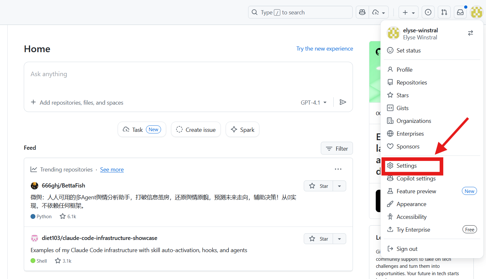
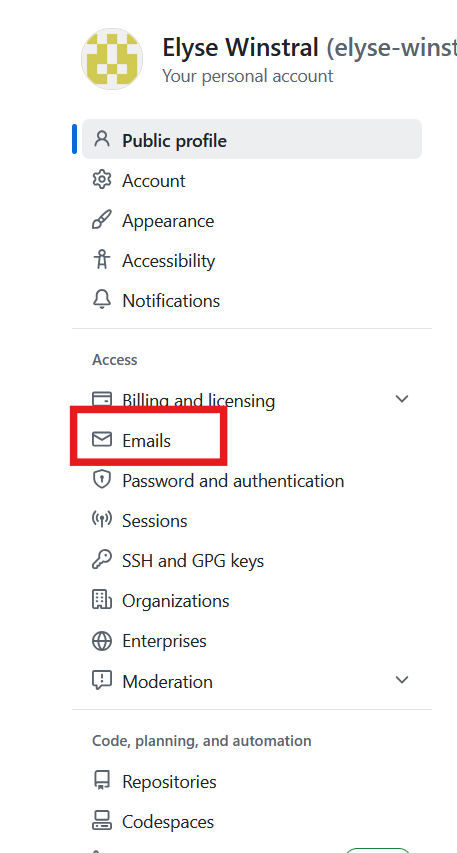
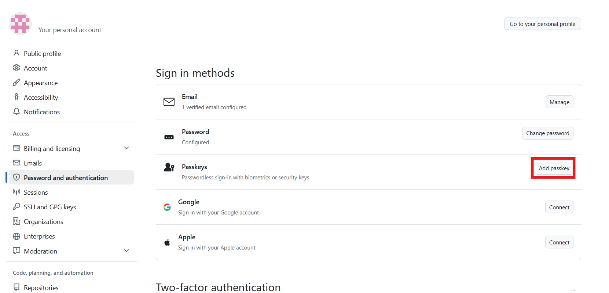
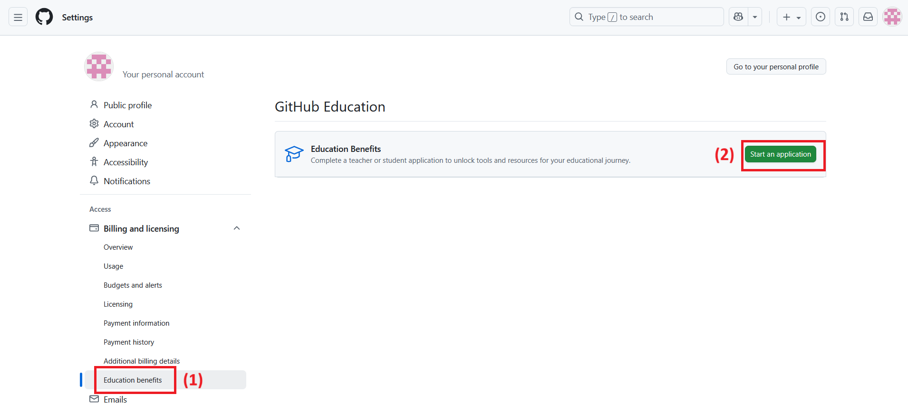
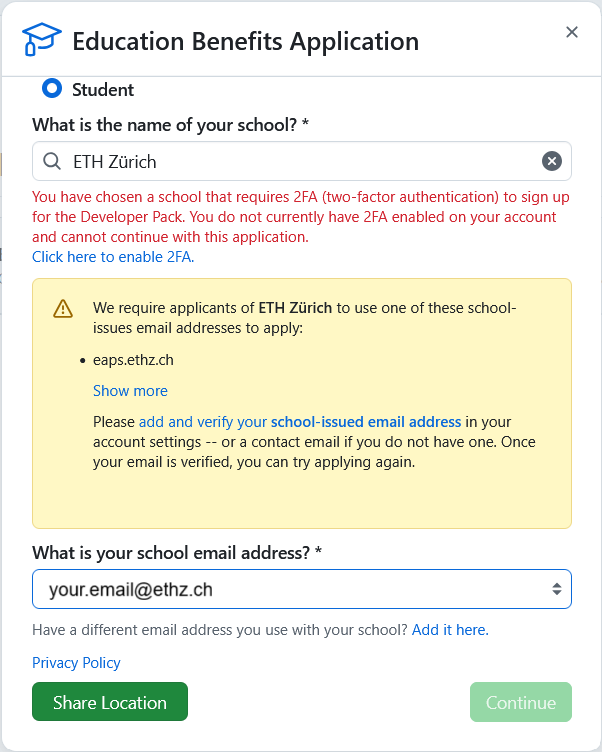
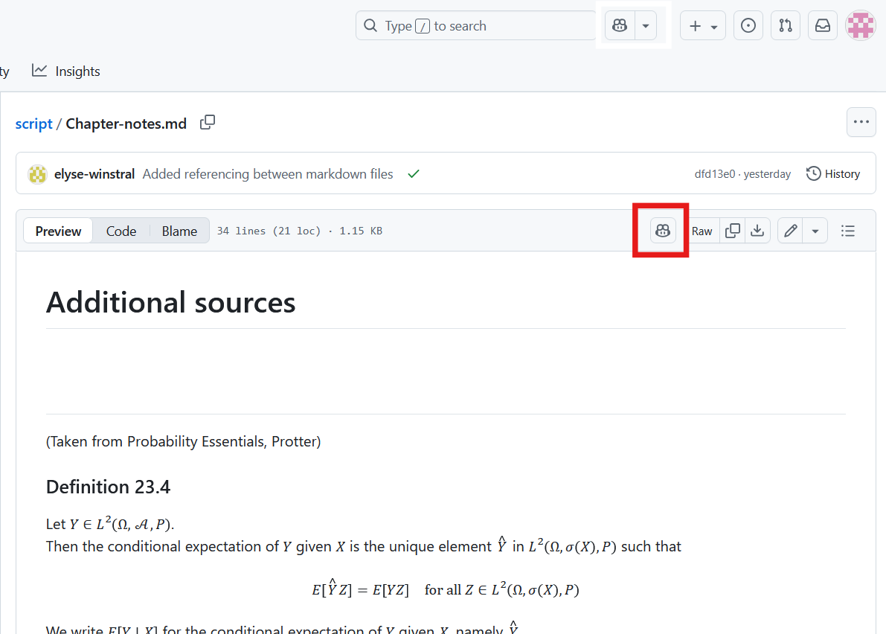

# Getting started with the script

This introduction is for students unfamiliar with GitHub and GitHub Copilot. GitHub is a platform for sharing, creating, and managing code. We're using GitHub for the script because it allows for:

1. Hosting Markdown documents that will serve as a traditional script
2. Interactive python notebooks
3. Access to GitHub Copilot- a range of LLMs that can serve as a tutor throughout the course

So, for example, you can read the script, view/edit a notebook corresponding to the script material and use Copilot to clear up questions you have with the code/ material. Or for example, you can ask Copilot for problems that might come up in the exam. We encourage you to take advantage of your access to AI. However, keep in mind LLMs are fallible and may be prone to hallucination. If you are unsure of an output, contact a TA.

In order to access Copilot, students will need an account linked with the ETH (students get Copilot access through the ETH). Reading the script and accessing the notebooks can be done without an account. 

This tutorial goes over the following: 

1. [Creating a GitHub account](#creating-a-github-account)
    <ol type="i">
        <li><a href="#synching-with-an-eth-email-address">Synching a pre-existing account with your ETH account</a></li>
        <li> <a href="#efficient-two-factor-authentication">Efficient two-factor authentication</a></li>
    </ol>
2. [Activating GitHub Education Access](#github-education-access)
3. [Navigating the repository](#navigating-the-repository)

---
# Creating a GitHub account
You can [create a GitHub account](https://github.com/signup?ref_cta=Sign+up&ref_loc=header+logged+out&ref_page=%2F&source=header-home) with any email of your choosing. You will likely use GitHub for more than this course, so it is advisable to use a private email at some point. Don't forget to verify your account.
If you don't use your ETH email, you can add another email in the next step. 

## Synching with an ETH email address
Once you've logged in, go to your profile settings: click on your profile picture in the top right corner > Settings. 

Under Access, go to [Emails](https://github.com/settings/emails) and add your ETH mail. It doesn't matter which one is the primary email address. 

## Efficient two-factor authentication

If you haven't enabled two-factor authentication you will be asked to enter a verification code each time you sign in. It's possible to configure a two-factor authentication method so that you can use passkeys, for example your device password, instead of an email verification. To do so, go to Settings, under the Access section, navigate to Passwords and authentication. Under Sign in methods, add a passkey. 

This should guide you to save your passkey to your device. Now, the next time you sign in, you can enter your device password as a 2FA method. 

---
# GitHub Education Access
In settings, go to Billing and Licensing > Education Benefits (1). Then Start an Application (2).

Fill out the form, be sure to use the ETH email, two-factor authentication is recommended.

It may take a couple days to process your request. Once it's been accepted you have more access to GitHub Copilot. Please note, you have a limited amount of queries per month. You can view how much you have used in Copilot Settings (below Settings). As an aside, Copilot can also be used for code completions- a very useful tool if working on a coding project.

---
# Navigating the repository

The repository is composed of Markdown files corresponding to each chapter, Python notebooks, and a docs folder for notebook operation (not relevant for students). 

While reading the script, you can click on the icon with pilot gear to open GitHub Copilot. If you're viewing a specific file when you open Copilot, only this file will be taken as a reference. If you have a question about a topic from multiple chapters, be sure to include the relevant files- or the entire repository.  

Copilot is mainly used for code related queries. It parses the code files in the repo and tends to give code-focused responses. When using Copilot with files in the repo, you may need to specificy whether you want a coding related answer- what the code in the file does- or a conceptual answer- what the code "is about". For example, instead of "explain what this notebook does", use "explain the statistical concepts used in this notebook". 
